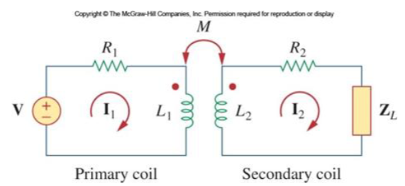
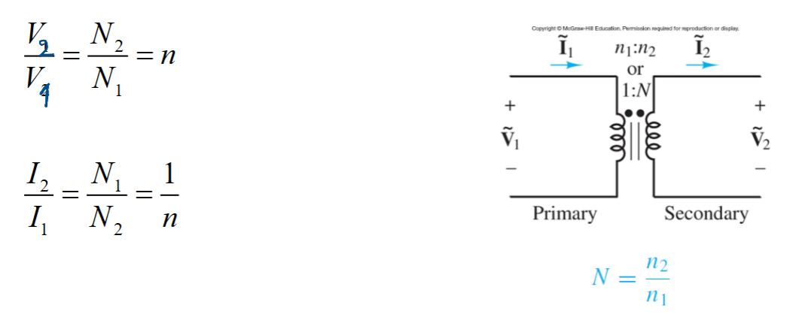
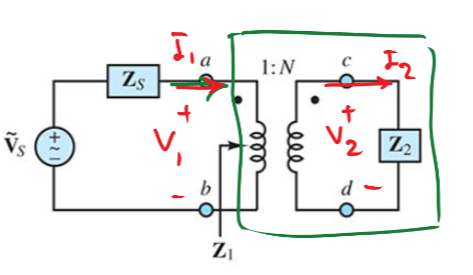
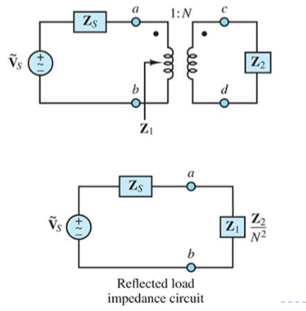
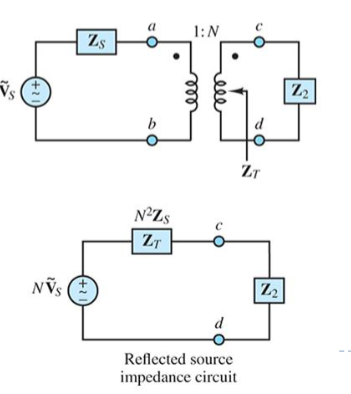
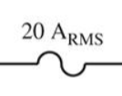

# Modul1-5 Transformers(변압기)
Mutual Inductnace( 상호 인덕턴스) 
Def:한 코일의 전류가 다른 코일에 전압을 유도하는 현상 
    * 기기의 전압을 바꾸는 장치 
    * inductance: current change ➔ magnetif flux ➔ voltage    

  when Two conductor are in close eache other, the magnetic flux Due to Current passing through will induce a voltage in other conductor. 
  두개의 컨덕터가 충분히 가까우면,자기 플럭스가 생성되서 전압을 유도(induce)한다. 
 

- Primary coil: connected to voltage source
- Secondary coil: connected to load 

### IDeal Tranformer
철(iorn) core가 가장 이상적 
   
 

- N is how many time turn (N 은 coil의 감긴회수를 말한다.) 
>* 전압은 코일의 감기 정비율로 결정 ( Directly propotional)
>* 전류는 코일의 감기 반비율로 결정( Inversly Proportional)

#### Condtion
- 승압(step-up transfromer): N>1
- 감압(Step-down transformer): N<1
- 절연(Isolation transformer): N = 1
### Transformers conserve power(에너지 보존)
$$S_{1} = V_{1}I_{1}^* = \frac{V_{2}}{n}(nI_{2})^*=v_{2}I_{2}^*=S_{2}$$
in  here the *(asterics) for complex conjugate.
- S = Complex Power 
- V = Voltage Phasor</sapn>
- I = curent phasor
### Impedance Reflection(임피던스 반사)

1. basic Transformer relationship $$1:N$$
2. Voltage relationship $$V_{2} = NV_{1} or V_{1}=\frac{V_{2}}{N}$$ 
3. In Ideal Tranformer $$I_{2} = \frac{I_{1}}{N} or I_{1}=V_{2}N$$
4. Primary Impedance $$Z_{1}= \frac{V_{1}}{I_{1}}$$ 
5. __Substitude Impedance V and I__ $$Z_{1}=\frac{V_{1}}{I_{1}}=\frac{V_{2}/N}{NI_{2}}=\frac{V_{2}}{{N^2}I_{2}}=\frac{Z_{2}}{N^2}$$
### Simplify Circut
* can remove the Transformer from the circut to simplify circut( 변압기 제거해 회로 단순화 )
1. Move Secondary to Primary

>- Transformer 제거
>- Secondary Impedance divide by N^2
>- Secondary Voltage 소스는 N으로 나눔 
2. MOve Primary to Secondary

>- Transformer 제거
>- Secondary Impedance mutiolied by N^2
>- Secondary Voltage 소스는 N을 곱함.  

### Remind 
$$Z_{L} = L\omega j$$
$$Z_{C} =- \frac{1}{C\omega j}$$
* 이때 VOLTAGE(v), Current(I) 둘다 Phasor로 바꿔줘야함. 

### Ideal powergenerators power maintain Untill delivered
 - 그래서 전압을 높이면 P=VI 식에 따라 전압을 높이면 전류가 작아져 송전손실이 크게 감소한다. 
 - 3상 + neutral ( 3-phase +neutral AC)
 - 전압은 RMS

- 집에 들어오는 3선:
>>Black Hot  
>>White Neutral( 전류가 소스로 반환되는 라인) 
>>Green ground 

breaker(Fuse라고도 함, 제약 전류에따라 값이 다름):  

## Transfomer는 전기적으로(물리적으로) 연결되어 있지 않음: isolating
- 노이즈 제거 
- 고전압이 저전압 회로로 전달되는것 방지
- 전력망과 회로를 분리
### Retifier
- 교류(AC)를 직류(DC)로 변환
- 전송은 AC로 하지만 사용(가전기기들)은 DC를 쓴다
- Diode 이용( 전류의 방향제어)
- Type:
    1. Half-wave rectifier
        - 다이오드 1개 사용
        - AC파형의 절반만 통과
        - 낮은 효율
    2. Full-wave Rectifier
        - 다이오드 2개 또는 4개사용
        - AC파형의 양쪽 반파를 보두 사용 
        - 높은 효율
    3. Bridge Retifiler 
        - 다이오드 4개 사용
        - 가장 많이사용

- 최대 전압을 만들기 위해서는 Rs(source registor)와 RL(load Registor)가 같아야한다. matchaing transformer 

# Module6 - 1 Frequency Response
- 기존은 교류정상 응답은 1개의 ω에대한 해석이지만, 주팍수응답은 모든 ω대한 해석이다.  
- 이를 통해 Magnitude, Phase 가 주파수에 따라 어떻게 변하는지 
- Frequency response 에서는 steady-state 상태만 본다 이때 시그마는 0$$ s=\sigma +j\omega$$
### Analysis frequency response
Transfer function(전달함수): 출력과 입력의 비율
$$ H(j\omega)= \frac{Output}{Input}$$
- forcing function = 입력 신호(input signal)
- forced function = 출력 신호(output signal)
### capciotor
>$$H(\omega)=\frac{V_{o}}{V_{s}}$$
>$$|H(\omega)| = \sqrt{\frac{1}{1+\omega^2R^2C^2}}$$
>$$\angle H = -tan^-1(\omega RC)$$

### Inductor
>$$H(\omega)=\frac{V_{o}}{V_{s}}$$
>$$|H(\omega)| = \frac{\omega L}{\sqrt{R^2+\omega^2 L^2}}$$
>$$\angle H = -tan^-1(\frac{\omega L}{R})$$
- 뒤에값은 임피던스 계산, Vo 계산에 따른다. 
### possible input/output

$$ H(\omega) = Voltage gain = \frac{V_{o}(\omega)}{V_{i}(\omega)}$$
$$H(\omega) = Voltage gain = \frac{I_{o}(\omega)}{I_{i}(\omega)}$$
$$H(\omega) = Transfer impedance = \frac{V_{o}(\omega)}{I_{i}(\omega)}$$
$$H(\omega) = Transfer impedance = \frac{I_{o}(\omega)}{V_{i}(\omega)}$$
### Decibel Scale
- Deci + Bel = $ 10^{-1} +\log_{10}\frac{Po}{Pin}$ 
PoWer Gain: $$G_{db}= 10log_{10} \frac{P_{out}}{P_{in}}$$
Voltage Gain: $$G_{db}= 20log_{10} \frac{v_{out}}{v_{in}}$$
## Bode Plot 
- 회로 시스템이 주파수에 따라 입력 신호를 어떻게 바꾸는지를 보여주는 그래프.
전달함수는 넓은주파수 범위에 대해 분석되어야 한다. 
주파수 응답을 세미로그 그래프에(x축을 로그 스케일로 표현) 나타나면 분석이 쉬움
- 보드플롯은 주파수에 대한 함수, H(ω)의 magnitude, phasor 를 보여준다. 
 H-ω, db-H 그래프
- 개념
>>만약 전환 공식이 아래와 같다면 $$H=\frac{AB}{C}$$
양변을 log화 하면 $$ log|H| = log(A)+log(B)-log(c)$$가 되고, 각 값의 각도는 $$\angle H= \angle A + \angle B - \angle C$$ 가된다

 ## Standard Form 
Complex algeba를 피하기 위해 jω를 S로 변환 -> Bode plot을 쉽게 그리기 위해  s= jω
$$ H(s)=\frac{N(s)}{D(s)}= \frac{AnS^n+A_{n-1}S^{n-1}+....}{BnS^m+B_{n-1}S^{n-1}+....}$$
 $$H(s)=Ks^{N} \frac{(1+s/z_{1})(1+k_{1}s+k_{2}s^2)+....}{(1+s/p_{1})(1+k_{3}s+k_{4}s^2)+....}$$
 - z= 0 , p = pole, z1= ωz1, p1 = ωp1
 - 분자 N(ω)가 0이면 H(ω)도 0이되고 영점(zero)라고 합니다.( 그 주파수에서 출력이 0이고 신호가 완전히 차단됨)
 - 분모 D(ω)가 0이면 H(ω)는 무한대 일때 Pole이라고 한다.( Gain의 값이 매우 커질때, criticla frequency,)   
 - __A gain K.__ 
    - Magnitude: $H(j\omega)= j\omega \rightarrow |H|=\omega \rightarrow |H|=20\log\omega$
    - Phasor: 0 
 - __Origin__ 
    -  One Zero at Origin  Magnitude: $H(j\omega)= j\omega \rightarrow |H|=\omega \rightarrow |H|=20\log\omega$ 
    Phasor: $\angle H = \tan^{-1}(\frac{\omega}{0})=90°$   
    - One pole at Origin 
    Magnitude: $H(j\omega)^{-1}=\frac{1}{j\omega} \rightarrow |H|=\frac{1}{\omega} \rightarrow |H|=- 20\log\omega$ 
    Phasor: $\angle H =- \tan^{-1}(\frac{\omega}{0})=-90°$
    - N Zero at Origin 
    Magnitude: $H(j\omega)= (j\omega)^N \rightarrow |H|=\omega^N \rightarrow |H|=20N\log\omega$ 
    Phasor: $\angle H =N \tan^{-1}(\frac{\omega}{0})=90N°$ 
        __각항에 N배__    
    - N Pole at Origin 
    Magnitude: $H(j\omega)^{-1}=\frac{1}{j\omega} \rightarrow |H|=\frac{1}{\omega} \rightarrow |H|=- 20\log\omega$ 
    Phasor: $\angle H =- \tan^{-1}(\frac{\omega}{0})=-90°$
 - __Simple__  
    - Simple Zero 
    Magnitude: $H(\omega)= (1+j\omega/z_{1}) \rightarrow |H|= (1+j\omega/z_{1}) \\ \rightarrow |H|_{db}= 20\log(1+j\omega/z_{1})$ 
    Phasor: $\angle H =\tan^{-1}(\frac{\omega}{Z_{1}})\;\; = 0\sim90\;으로 증가$
    - Simple Pole 
    Magnitude: $H(\omega)= \frac{1}{(1+j\omega/p_{1})} \rightarrow |H|=\frac{1}{(1+j\omega/p_{1})} \rightarrow |H|=- 20\log(1+j\omega/p_{1})$ 
    Phasor: $\angle H =- \tan^{-1}(\frac{\omega}{p1})=0\sim -90\;으로 감소$
- __Quadratic__
    - Quadratic Zero 
    Magnitude: $H(\omega)= 1+\frac{j2ζ\omega_{1}}{\omega_{k}}+(\frac{j\omega}{\omega_k})^2 \rightarrow |H|=1+\frac{j2ζ\omega_{1}}{\omega_{k}}+(\frac{j\omega}{\omega_k})^2\\ \rightarrow |H|= 20\log(1+\frac{j2ζ\omega_{1}}{\omega_{k}}+(\frac{j\omega}{\omega_k})^2)$ 
    Phasor: $\angle H =\tan^{-1}(\frac{2ζ\frac{\omega}{p1}}{1-\frac{\omega}{p1}})=0\sim 180로 증가$
    - Quadratic Pole 
    Magnitude: $H(\omega)= \frac{1}{(1+\frac{j2ζ\omega_{1}}{\omega_{k}}+(\frac{j\omega}{\omega_k})^2)} \rightarrow |H|=\frac{1}{(1+\frac{j2ζ\omega_{1}}{\omega_{k}}+(\frac{j\omega}{\omega_k})^2)}\\ \rightarrow |H|=- 20\log(1+\frac{j2ζ\omega_{1}}{\omega_{k}}+(\frac{j\omega}{\omega_k})^2)$ 
   Phasor: $\angle H =-\tan^{-1}(\frac{2ζ\frac{\omega}{z1}}{1-\frac{\omega}{z1}})=0\sim -180로 감소$
    - N Quadratic Zero 
    Magnitude: $H(\omega)= (1+\frac{j2ζ\omega_{1}}{\omega_{k}}+(\frac{j\omega}{\omega_k})^2)^N  \rightarrow \\|H|=20N\log(1+\frac{j2ζ\omega_{1}}{\omega_{k}}+(\frac{j\omega}{\omega_k})^2)$ 
   Phasor: $\angle H =N\tan^{-1}(\frac{2ζ\frac{\omega}{p1}}{1-\frac{\omega}{p1}})=0\sim 180N로 증가$
    - N Quadratic Pole 
    Magnitude: $H(\omega)= \frac{1}{(1+\frac{j2ζ\omega_{1}}{\omega_{k}}+(\frac{j\omega}{\omega_k})^2)^N} \rightarrow |H|=\frac{1}{(1+\frac{j2ζ\omega_{1}}{\omega_{k}}+(\frac{j\omega}{\omega_k})^2)^N}\\ \rightarrow |H|=- 20N\log(1+\frac{j2ζ\omega_{1}}{\omega_{k}}+(\frac{j\omega}{\omega_k})^2)^N$ 
      Phasor: $\angle H =-N\tan^{-1}(\frac{2ζ\frac{\omega}{z1}}{1-\frac{\omega}{z1}})=0\sim -180N로 감소$
 - A zer or a pole Determinat $$n-m= (jw)^{\pm 1}$$
- queatratic zero pole $$zero = 1+\frac{j2ζ\omega_{1}}{\omega_{k}}+(\frac{j\omega}{\omega_k})^2 \;and\;  pole= 1/1+\frac{j2ζ\omega_{1}}{\omega_{k}}+(\frac{j\omega}{\omega_k})^2$$
- A simple $$zero = (1+j\omega/z_{1})\;and\; pole = (1+j\omega/p_{1})$$
### phasor값 정리
| 항|phase 변화|
|---|---|
|Orogin Zero|+90|
|Orogin pole|-90|
|Simple Zero|0->90증가|
|simepl pole|0->-90감소|
|quadratic Zero|0->180증가|
|quadratic pole|0->-180감소|
|N quadratic Zero|0->180N증가|
|N quadratic pole|0->-180N감소|
---
***
---
## 개념 정리 
- __standard form은 말그대로 정규 표현식으로 항들이 전부 있을수 있고 하나만 존재할수도 있다.__ 
-  __각  항의 zero(gain 증가= slope증가), pole(gain 감소= slope 감소) 의 구간을 분석한다.__
- 그로부터 만들어지는 각 H를 더한다.  
---

### Draw Bode Plot
1. H(S) = K (__Gain k__)  
H(jω)= H|(S)| = K 
    - 크기(magnitude): 상수값 직선 
    - 위상(pahsor): 상수값 0 직선 
2. $H(S) = S^{\pm N}$
    1. $S$
    H(jω) = jω
        - 크기(magnitude) 
       $|H|=ω$ 
       $|H|_{db} = 20log\omega$ 
        * ω = 1 -> 0(H)db
        * ω1과 ω2(=nω1)에서의 이득차이 (기울기) 
        * $A = ω2이득 - 이득ω1 = 20\log\omega_{2}-=20\log\omega_{1}=20\log\frac{\omega_{2}}{\omega_{1}} $ 
        * 기울기 2배 octave(옥타브로) __6db/oct__  
        기울기 10배 Decade -> db/dec   
        - 위상(pahsor) 
        ω값과 상관없이 상수$\angle H = tan^{-1}(\frac{\omega}{0})= 90°$  상수값 직선 
    2. $1/S=S^{-1}$
        - 크기(magnitude) 
    $|H|=\frac{1}{\omega} \rightarrow \; |H|_{db}=20\log \frac{1}{\omega} $ 
        - 위상(pahsor):
    (-) 음수값을 가진다. -90도
    3. $S^2$
        - 크기 $|H| = \omega^2 \rightarrow \; |H|_{db} = 20\log \omega^2 $  모두두배
        - 위상 180도 
    4. $S^{\pm N}$
        - 크기$
        - 위상  
3. $H(s) = (S+q/q)^{\pm N}$ Simple zeo 

4. $(\frac{S^2+2(\omega_{m}S+\omega_{m}^2)}{\omega_{m}})^2$